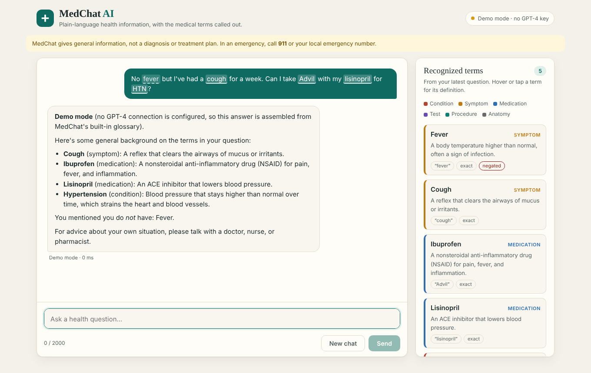
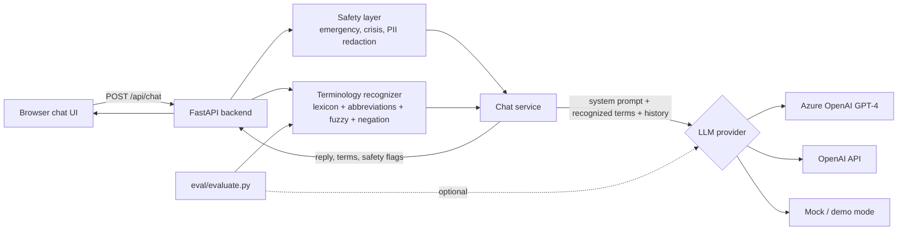

# MedChat AI

A healthcare-focused chatbot built with **Python**, **Azure OpenAI (GPT-4)** and **FastAPI**. Users ask health questions in plain language and get a conversational answer. Alongside the answer, the app shows the medical terms it recognized in the question: conditions, symptoms, medications, tests, procedures and anatomy. Each term comes with a plain-language definition and a flag for whether the user said they *don't* have it ("no fever").

The project includes a reproducible **evaluation harness** that measures how accurately the system recognizes medical terminology, against two labeled question sets.



> MedChat provides general health information, not medical advice, diagnosis or treatment.

---

## Features

- **Chat interface**: responsive web UI with loading, error and emergency states, suggested questions, and conversation memory (recent turns are sent as context).
- **GPT-4 responses** through Azure OpenAI Service, or the OpenAI API, behind one provider interface. With no credentials it runs in a clearly labeled **demo mode**, so the app, tests and evaluation all work offline.
- **Medical terminology recognition**: a curated lexicon of 181 concepts and about 870 surface forms. It covers clinical names, lay phrasings ("high blood pressure"), brand names ("Advil"), abbreviations ("HTN", "UTI"), plurals, hyphen variants, misspellings (fuzzy matching), and negation ("denies chest pain").
- **Grounded prompting**: recognized terms, with their definitions and negation status, are added to GPT-4's system prompt, so the model knows exactly what the user is asking about.
- **Safety layer**, run *before* the model call:
  - Red-flag detection (stroke signs, severe chest pain, anaphylaxis…) shows an emergency banner, whatever the model says.
  - Self-harm language returns crisis resources (988) immediately, without calling the model.
  - Emails, phone numbers, SSNs, dates of birth and record numbers are redacted before anything leaves the server.
- **Production basics**: input validation, per-IP rate limiting, timeouts and retries, graceful degradation when the model is unavailable, structured logging, health endpoint, Dockerfile, and a GitHub Actions CI workflow that runs the tests and the evaluation.

## Architecture



Request flow: the user submits a question. The backend validates it, runs the safety checks and recognizes medical terms. It then sends the redacted question, the recognized-term context and recent history to GPT-4, and returns `{reply, terms, safety, provider, latency}`. The UI highlights the terms in the user's message and lists them in a side panel.

## Project layout

```
medchat/
  api.py           FastAPI app: /api/chat, /api/terms, /api/concepts/{id}, /api/health, static UI
  chat.py          Orchestration (safety -> recognition -> GPT-4) and the GPT-4 term extractor
  terminology.py   Medical terminology recognizer
  safety.py        Emergency/crisis detection and PII redaction
  llm.py           Azure OpenAI, OpenAI and mock providers
  prompts.py       System prompt and extraction prompt
  config.py        Environment-based settings
frontend/          index.html, styles.css, app.js (no build step)
data/medical_lexicon.json
eval/
  dataset.jsonl    90 labeled development questions
  holdout.jsonl    40 labeled held-out questions
  evaluate.py      Precision / recall / F1 / negation accuracy, by category and question type
  results/         Generated reports (report.md, results.json)
tests/             47 unit and API tests
docs/              Azure deployment guide, evaluation write-up, screenshots
```

## Quick start

```bash
python -m venv .venv && source .venv/bin/activate   # Windows: .venv\Scripts\activate
pip install -r requirements-dev.txt
cp .env.example .env            # add Azure OpenAI credentials, or leave blank for demo mode
uvicorn medchat.api:app --reload
```

Open http://localhost:8000. Interactive API docs are at http://localhost:8000/docs.

### Connect GPT-4 on Azure

In `.env`:

```
LLM_PROVIDER=azure
AZURE_OPENAI_ENDPOINT=https://<your-resource>.openai.azure.com
AZURE_OPENAI_API_KEY=<key>
AZURE_OPENAI_DEPLOYMENT=<your GPT-4 deployment name>
```

The status pill in the header switches from "Demo mode" to "Azure OpenAI · <model>". To use the OpenAI API directly instead, set `LLM_PROVIDER=openai` and `OPENAI_API_KEY`. See [docs/azure-deployment.md](docs/azure-deployment.md) for creating the Azure resources and deploying the app.

### Run tests and the evaluation

```bash
pytest -q
python -m eval.evaluate                                   # dev set, lexicon recognizer
python -m eval.evaluate --dataset eval/holdout.jsonl --out eval/results/holdout
python -m eval.evaluate --method all                      # also GPT-4-only and hybrid, if credentials are set
```

## API

`POST /api/chat`

```json
{ "message": "No fever but I have a cough. Can I take Advil with lisinopril?",
  "history": [{ "role": "user", "content": "..." }, { "role": "assistant", "content": "..." }] }
```

Response (abridged):

```json
{
  "reply": "...",
  "terms": [
    { "concept_id": "fever", "term": "Fever", "category": "symptom", "text": "fever",
      "start": 3, "end": 8, "match_type": "exact", "negated": true, "definition": "..." },
    { "concept_id": "ibuprofen", "term": "Ibuprofen", "category": "medication", "text": "Advil", "...": "..." }
  ],
  "safety": { "emergency": false, "emergency_reasons": [], "crisis": false, "redactions": [] },
  "provider": "azure", "model": "gpt-4", "latency_ms": 1840, "degraded": false, "notices": []
}
```

Also available: `POST /api/terms` (recognition only), `GET /api/concepts/{id}`, and `GET /api/health`.

## Evaluation results

Concept-level metrics, micro-averaged over questions. Full reports, including every error, are in [`eval/results/`](eval/results/), and the method is described in [docs/evaluation.md](docs/evaluation.md).

| Test set | Questions | Precision | Recall | F1 | Strict recall* | Negation accuracy |
|---|---|---|---|---|---|---|
| Development (`dataset.jsonl`) | 90 | 98.8% | 95.8% | 97.3% | 90.4% | 97.5% |
| **Held-out (`holdout.jsonl`)** | 40 | **100.0%** | **85.7%** | **92.3%** | **65.1%** | **96.3%** |

\*Strict recall also counts medical terms that a human annotator marked but the lexicon has no entry for (for example "chickenpox" or "pulse oximetry") as misses. It measures coverage, not just matching.

**How to read these numbers.** The development set was written together with the lexicon, so it overstates real-world performance. The held-out set was written afterward, in a different style (informal, clinical shorthand, typos), and the recognizer was not changed after it was scored. **The held-out numbers are the honest ones.** Both sets are small and were labeled by one person, so treat them as indicative, not definitive.

**What it gets wrong.** Most misses are lay descriptions that don't use a fixed phrase ("my whole body hurts", "a temp of 101", "speech was slurred"), plus terms missing from the lexicon. Precision is high because the matcher only fires on known phrases. The `--method llm` and `--method hybrid` modes let GPT-4 extract terms to close that recall gap. Run them with your Azure credentials to compare.

## Safety and privacy notes

- The PII redaction and emergency detection are pattern-based safeguards. They reduce risk, but they are **not** a HIPAA compliance program. A real deployment handling patient data would also need a BAA with the cloud provider, access controls, audit logging, encryption and retention policies, and a security review.
- No conversation data is stored server-side. Chat history lives in the browser tab and is sent with each request.
- Responses are general information. The system prompt instructs GPT-4 not to diagnose or give personal dosing, and to direct users to emergency care when warranted.

## Tech stack

Python 3.11+, FastAPI, Pydantic, Uvicorn, OpenAI Python SDK (Azure OpenAI client), vanilla HTML/CSS/JS, pytest, Docker, GitHub Actions.
